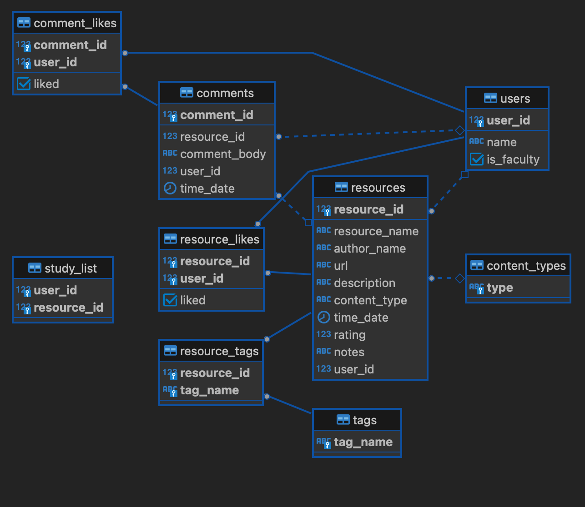

# Resource Sharer - Backend
## Summary
This project is a study resources library that users can personalise by creating their own 'study list' of resources. This is an Express app which manages a RESTful API the resource information is stored persistently in a Postgres database which is queried at relevant endpoints.

Links to the repos and deployed sites for this project can be found here:
|           | GitHub Repo              | Deployed |
|-----------|--------------------------|----------|
| Front-end | <a href='https://github.com/niamhbrockbank/resource-sharer'>resources-sharer</a>         | <a href='https://resource-sharer.netlify.app/'>Netlify</a>  |
| Back-end  | <a href='https://github.com/niamhbrockbank/resource-sharer-backend'>resources-sharer-backen</a> | <a href='https://resource-sharer.onrender.com/resources'>render</a>   |

## Features
Currently working on:
* Swagger API documentation (can be found at <a href='https://resource-sharer.onrender.com/api-docs/'>/api-docs/</a> )
* Using the Express Router class to make the `server.ts` code more concise
* Updating endpoints so that they are consistent across different request types

Features coming soon:
* Using Swagger components to define repeated parameters
* Reducing the number of endpoints and making greater use of request and response bodies 
## Install

`yarn` to install dependencies.

### DB Setup

Set up your local database using the queries within the sql folder.
 1. Run `createTables.sql`
 2. (Optional) Run `populateData.sql` if you'd like some placeholder data to work with.

Copy .env.example to .env and set `DATABASE_URL` and `PORT` to your liking.

Example for a local database: `DATABASE_URL=postgres://userl@localhost/resource_db`
### Running locally

`yarn start:dev`

This will set the env var LOCAL to true, which will cause the db connection configuration to NOT use SSL (appropriate for your local db)

## Documentation
API documentation can be found <a href='https://resource-sharer.onrender.com/api-docs/'>here</a>.

Table schema, showing the relationships between the tables:

